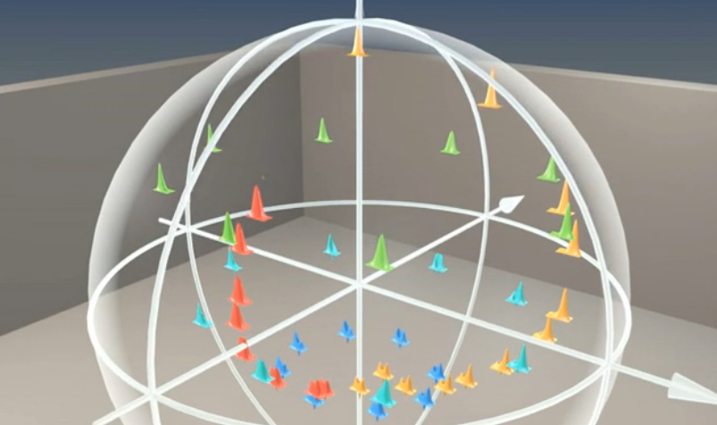

# SCIQIS: Possible projects 

## Homodyne tomography

With homodyne detection of many identical copies of a quantum state, it is possible to reconstruct the Wigner function and density matrix.

Compare different reconstruction methods, e.g. inverse Radon, maximum likelihood, [Bayesian Mean Estimate](https://iopscience.iop.org/article/10.1088/1367-2630/12/4/043034/meta). Multi-mode states. You could also try to reproduce the results in [this paper](https://journals.aps.org/prl/abstract/10.1103/PhysRevLett.105.053602) of mine.

## Dolinar receiver

The [Dolinar receiver](https://omni.wikiwand.com/en/articles/Dolinar_receiver) is a feedback photon detector that can optimally distinguish between unknown quantum states from a known set. For multiple states, the optimal decision strategy is a complex optimisation problem. 

Devise a strategy for discrimating different states (or a general strategy). There has been many developments in this direction in recent years (e.g. [this](https://www.nature.com/articles/s41377-022-01039-5)), so perhaps the problem has already been solved.

## Gaussian Boson Sampler generation + visualisation

Gaussian Boson Sampling is a network of beamsplitters, fed at the input with squeezed vacuum states, and sampled at the output with photon counters. It is a form of random circuit sampling.

Simulate the system and visualise the circuit and perhaps the entangled state at the output.

## Simulate GKP state generation

GKP states is a specific class of complex quantum states that can be used as "continuous-variable qubits". They have been generated in [trapped ions](https://www.nature.com/articles/s41586-019-0960-6) and in [superconducting microwave cavities](https://www.nature.com/articles/s41586-020-2603-3).

Use QuTiP to simulate these protocols in detail - perhaps you can reproduce the results from the papers (not experimentally of course).

## Teleportation simulation

Dig deep into one of the most famous quantum information protocols: Quantum teleportation. Simulate the protocol using qubits and/or continuous variables. Include imperfections. Expand the model in different directions.

## Compare different quantum computing frameworks

There are a bunch of quantum circuit simulation frameworks. Which is faster, more user friendly, compatible with different backends, etc.?
Test many of them on specific tasks and make a detailed comparison.

Examples: [Qiskit](https://www.ibm.com/quantum/qiskit),  [Cirq](https://quantumai.google/cirq) (and [qsim](https://quantumai.google/qsim)), [ProjectQ](https://projectq.ch), [QuTiP](https://qutip.org/), [Pennylane](https://pennylane.ai), [Qulacs](https://docs.qulacs.org/en/latest/), ... (many more listed [here](https://quantiki.org/wiki/list-qc-simulators)).

Inspiration for [benchmarking](https://github.com/yardstiq/quantum-benchmarks).

## Wigner functions or qubits in Blender

Using Blender's comprehensive Python interface, create animations of e.g. qubits on the Bloch spheres or continuous-variable states' Wigner functions. Perform operations on the states. 

## Graphical circuit simulator

Python version of [quirk](https://algassert.com/quirk).

_Note that Python is not the obvious language to use for this type of project - JavaScript would be better suited._

## The Sound of Quantum

Convert the quantum noise of different states of the quantum harmonic oscillator to sound and potentially also animation. 

_Note that Python is not the obvious language to use for this type of project - JavaScript would be better suited._